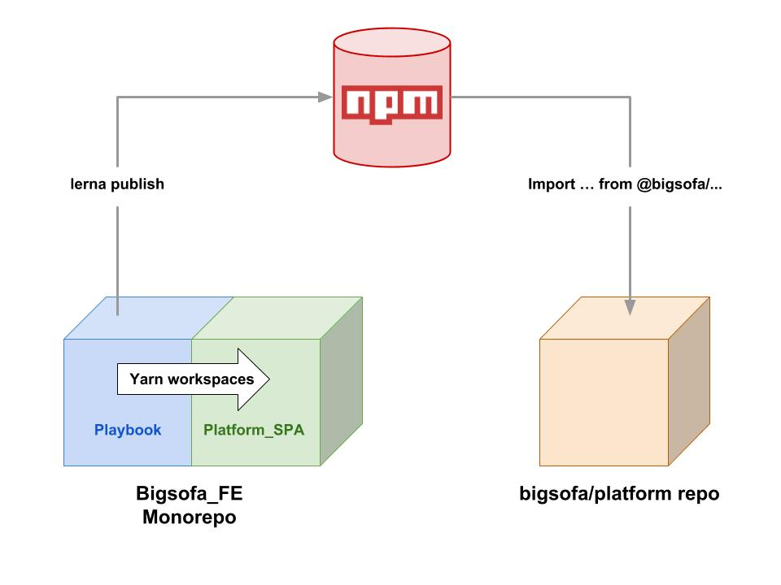

# Platform architecture

At Bigsofa we are currently undergoing a large scale rewrite of both the Front end and Back end.

This has been an opportunity to lay down some structure that does not exist in the Rails app. For the front end we have a business need to continue to add new components to the monolith. As such architecture of the Greenfield work is of vital importance.

## Solution

The solution to having parallel platforms, both of which need to ingest our new components has been to break the environment in which we create new components away from the platform repository.

All new components are now created in an instance of React Storybook called the `Playbook` (Which is where you should be reading this!!) which resides in a Front end Monorepo, the `BigSofa_FE` repository. Components are platform agnostic and the only prerequisite for them to function is that they have been supplied the correct data/props (via the `v2 API` or via a mock) and that they can interact with the correct API endpoints (or stubbed endpoints) for `CRUD` actions.

Inside Storybook new components are grouped together into packages which are then published privately to NPM/Nexus in order that they can be used in the main Platform repo and any other project that we allow to have access to them.

eg.

```jsx
import { BigSofaButton } from @bigsofa/ui

...

<BigSofaButton onClick={() => clickAction}>Click me</BigSofaButton>
```

All other front end apps including the new `Platform_SPA` and any other satellite apps which get created in the future will have access to the packages in the same way as they do packages from the NPM registry.



## Publishing

All of our packages exist in a monorepo so that we can control the versioning and publishing using [Lerna](https://lernajs.io/) and [Yarn workspaces](https://yarnpkg.com/lang/en/docs/workspaces/).

### Lerna basics (please read the [docs](https://github.com/lerna/lerna#readme))

lerna is "A tool for managing JavaScript projects with multiple packages."

Essentially it tracks changes in multiple specified directories and allows us to add version numbers to them and publish them together or separately. The only requirement for a package is that it contains it's own `package.json`, with a `name` field.

Lerna, in the `BigSofa_FE` Monorepo, has been specified to look for packages in the **_ & _**.

To set up a package run...

```
lerna bootstrap
```

...which will detect all the packages in our repo and add them to Lerna.

We can then publish them to NPM with the...

```
lerna publish
```

...command.

If there have been no changes to any of the packages, the script will fail and alert us to this. If it detects code changes it will prompt us to change the [semver](https://semver.org/) if our package, and then it automatically publishes to NPM and Github.

It offers two types of version tracking.

_From Lerna docs_

**Fixed mode** Lerna projects operate on a single version line. The version is kept in the lerna.json file at the root of your project under the version key. When you run lerna publish, if a module has been updated since the last time a release was made, it will be updated to the new version you're releasing. This means that you only publish a new version of a package when you need to.

**Independent mode** Lerna projects allows maintainers to increment package versions independently of each other. Each time you publish, you will get a prompt for each package that has changed to specify if it's a patch, minor, major or custom change.

[FOR DISCUSSION]

We use independent mode as we would like to retain the option of deploying/publishing independent packages from the development project specifically.

There is lots more to it so please familiarise yourself with the docs.

`// Will add more detail here as I learn it`

### Workspaces basics

Lerna also works with [Yarn workspaces](https://yarnpkg.com/lang/en/docs/workspaces/) which is how we share components internally within the `BigSofa_FE` Monorepo.

It is set up by adding the following to the root `package.json`

```json
  "private": true,
  "workspaces": {
    "packages": [
      "*",
      "bs_components/**"
    ],
    "nohoist": [
      "**/eslint",
      "react-scripts",
      "react-scripts/**",
      "**/jest/**"
    ]
  }
```

The workspaces are a set of directories specified directly or using glob patterns that tell Yarn where to look for packages.

Like lerna it uses `package.json` files to distinguish packages within the repo but also allows us to specify workspaces which can be thought of as individual projects within the larger repository.

Each of these projects has it's own dependency tree, our `develop` workspace is a CRA with React Storybook installed inside it, whereas the `Platform_FE` is a fully fledged CRA SPA application. Yarn workspaces allows us to control all these dependencies from the monorepo root and so that shared dependencies can be added only once, or can be specified to be added in a workspce instead of the root `node_modules` if that is preferable ([hoisting & the nohoist option](https://yarnpkg.com/blog/2018/02/15/nohoist/)).

It also allows us to import packages defined in one workspace into another and to see our changes instantly reflected anywhere it is imported.

```jsx
import { BigSofaButton } from @bigsofa/ui
// Same as before only this time the package is imported from the local repo rather than the NPM registry

...

<BigSofaButton onClick={() => clickAction}>Click me</BigSofaButton>
```

## ES6+ Gotchas

Because our packages are private and for internal use only, we do not transpile them to ES5 for wider compatibility. because by default [Babel](https://babeljs.io/) will not transpile packages found in the `node_modules` folder we have employed the following pattern in our Platform repo, which uses [Webpacker](https://github.com/rails/webpacker) to package it's React components,

Adding this option to the Babel loader configuration in the webpack config will ignore all packages in node_modules except those that match the regex provided, in this case anything in the `@bigsofa` namespace.

```
exclude: /node_modules\/(?!(@bigsofa)\/).*/
```

`Create-react-app` which is in use in the `platform_FE` package, already has this ability baked into version 2 but until that is released you must upgrade react-scripts.

```
yarn upgrade react-scripts@2.0.0-next.3e165448
```

(Correct at time of writing)
